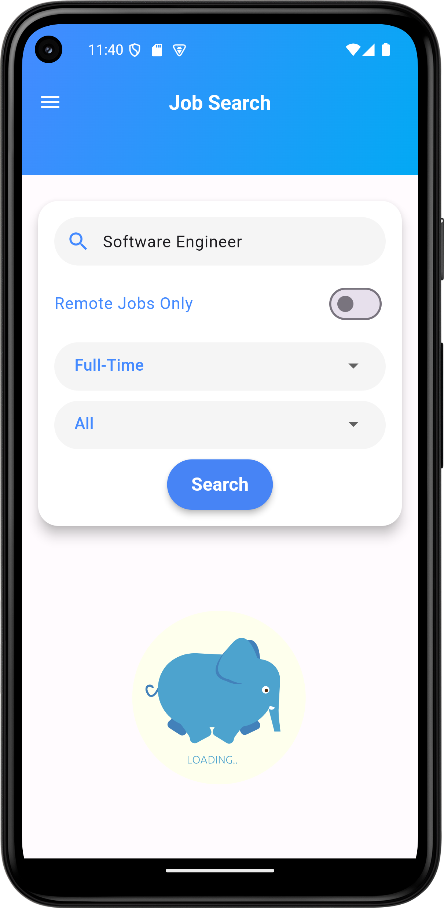
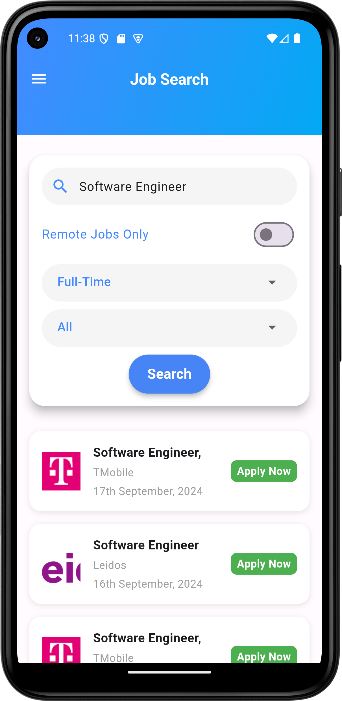
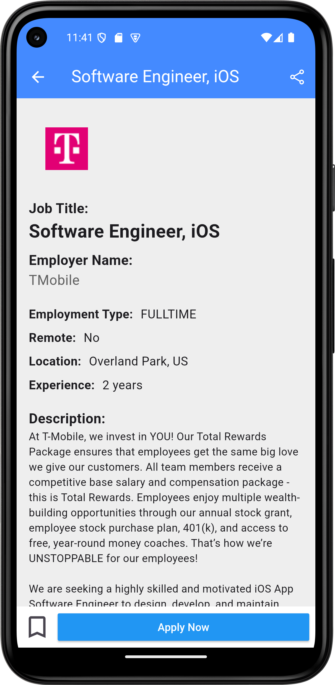
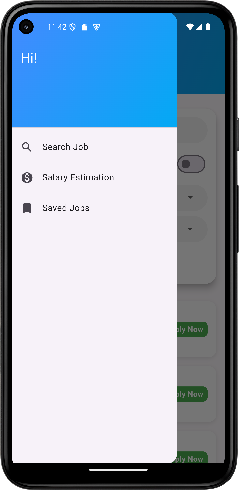
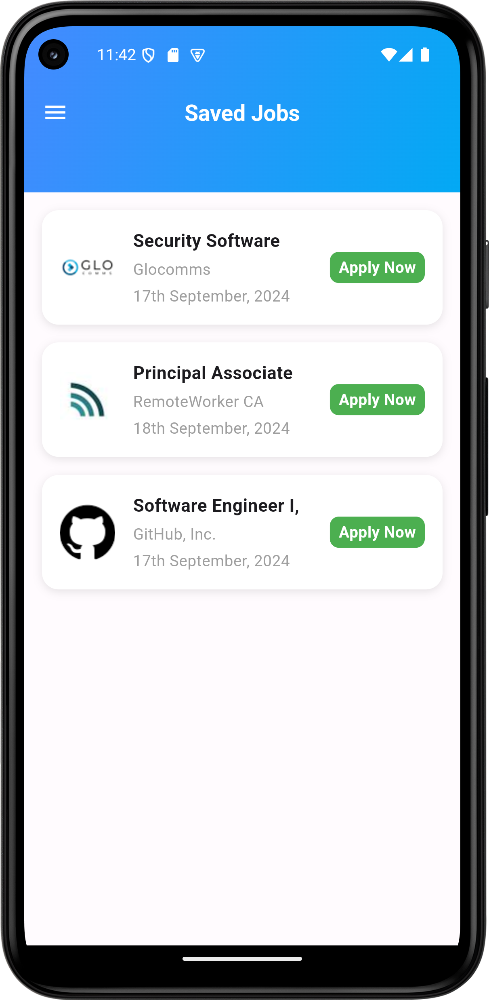
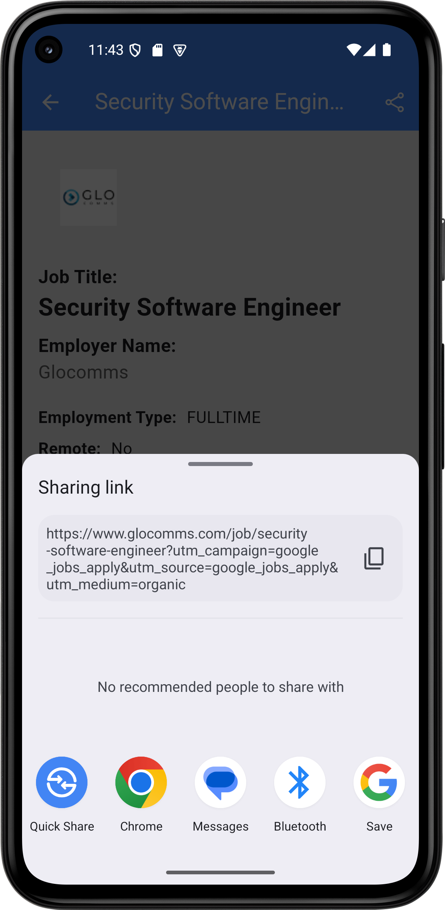
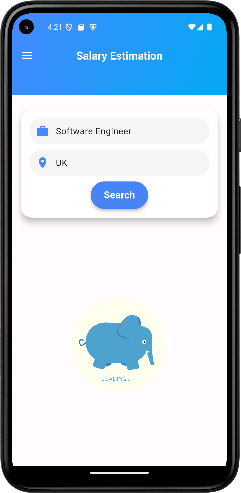
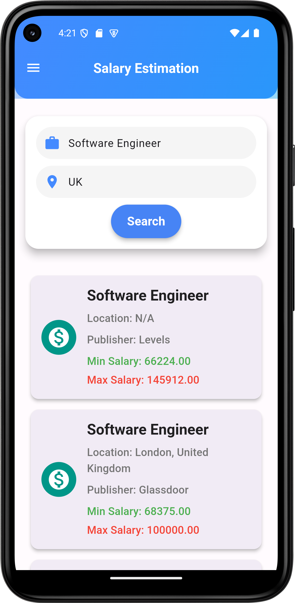
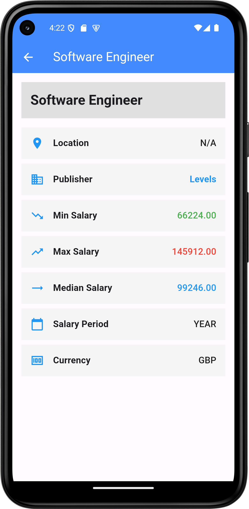

# Job Search App

A Flutter app designed to enhance job search experiences. It offers functionalities like searching for jobs, viewing detailed job listings, and managing saved jobs. The app utilizes modern architectural patterns and state management techniques to provide a smooth user experience.

## 🎥 Demo

Below are some screenshots showcasing the features of the app:

<table>
  <tr>
    <td></td>
    <td></td>
    <td></td>
  </tr>
  <tr>
    <td></td>
    <td></td>
    <td></td>
  </tr>
  <tr>
    <td></td>
    <td></td>
    <td></td>
  </tr>
</table>
 

## 🚀 Features

- **Job Search**: Search for jobs using various filters.
- **Job Details**: View detailed information about job listings.
- **Bookmark Jobs**: Save jobs for later reference.
- **Local Storage**: Persist bookmarked jobs locally using Isar.
- **Direct Apply Option**: Apply directly to job listings from within the app.
- **Share Job Option**: Share job listings with others via different platforms.
- **Dynamic Updates**: Refresh the bookmarked job list upon returning from the job detail screen.

## 🏛️ Architecture/Design

- **Clean Architecture**: Separate layers for presentation, domain, and data.
- **Bloc Pattern**: Used for state management.

## 🛠️ Technologies Used

- Flutter
- Dart
- GetIt (for dependency injection)
- Bloc (for state management)

## 🚧 Installation & Usage

1. Clone the repository: `git clone https://github.com/your_username/job-search-app.git`
2. Navigate to the project directory: `cd job-search-app`
3. Get dependencies: `flutter pub get`
4. Run the app: `flutter run`

## 📃 Motivation

This project was developed to provide a seamless job search experience and manage job bookmarks effectively. It serves as a practical example of using Flutter with modern architectural patterns.

## 📦 Packages Used

- [Get Storage](https://pub.dev/packages/get_storage)
- [Flutter Bloc](https://pub.dev/packages/flutter_bloc)
- [GetIt](https://pub.dev/packages/get_it)

## ❓ QA

#### Q: Why are bookmarked jobs not showing after app restart?
<pre>
A: Ensure that GetStorageService is correctly initialized and used. Check that the instance is properly set up as a singleton and that data is not being lost due to incorrect initialization.
</pre>

#### Q: How can I refresh the list of bookmarked jobs when navigating back from the job details screen?
<pre>
A: Use a BlocListener or NavigatorObserver to trigger a state refresh when returning to the BookmarkedJobsScreen. You can add an event to fetch the latest data from the local storage upon screen re-appearance.
</pre>

## 📖 Explore

- [Flutter](https://flutter.dev/)
- [Dart](https://dart.dev/)
- [Bloc Library](https://bloclibrary.dev/)

## 📞 Contact

For any inquiries or collaboration requests, feel free to reach out via [email](mailto:alxayeed@gmail.com) or connect on [LinkedIn](https://www.linkedin.com/in/alxayeed).
